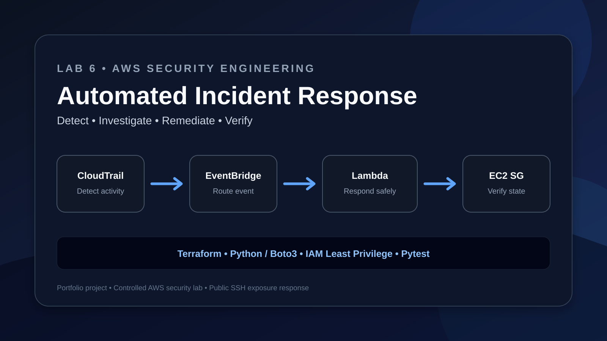
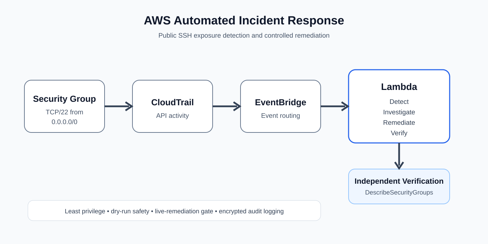

# AWS Security Detection & Automated Incident Response

[](https://github.com/ozangirginwork-wq/aws-security-automated-incident-response/actions/workflows/ci.yml)

A hands-on AWS security engineering project that detects dangerous security group changes and automatically remediates public SSH exposure using an event-driven, least-privilege architecture.



> **Portfolio focus:** cloud security, incident response, security automation, Infrastructure as Code, Python/Boto3, IAM least privilege, and post-remediation verification.

The project demonstrates a complete incident-response workflow:

**Detect → Investigate → Remediate → Verify**

When an AWS security group is modified to allow SSH (TCP/22) from `0.0.0.0/0`, the system detects the CloudTrail event, invokes an AWS Lambda response function, removes the dangerous ingress rule, and independently verifies that the exposure no longer exists.

---

## Architecture



The infrastructure is provisioned with Terraform.

```text
Security Group Change
        │
        ▼
   AWS CloudTrail
        │
        ▼
 Amazon EventBridge
        │
        ▼
 Incident Response Lambda
        │
        ├── Detect
        ├── Investigate
        ├── Remediate
        └── Verify
        │
        ▼
 Protected Security Group
```

---

## Incident Scenario

The simulated security incident is an EC2 security group modification that exposes:

```text
TCP/22
0.0.0.0/0
```

This represents SSH being opened to the entire IPv4 internet.

The project responds automatically rather than relying on manual investigation and remediation.

---

## Detection

CloudTrail records AWS API activity.

EventBridge monitors for:

```text
AuthorizeSecurityGroupIngress
```

The Lambda detector then examines the event and determines whether the new rule exposes TCP port 22 to `0.0.0.0/0`.

Benign changes such as restricted SSH access or public HTTPS are ignored by the detector.

---

## Investigation

When dangerous SSH exposure is detected, the Lambda function extracts incident context including:

- API event
- identity type
- actor
- source IP
- affected security group
- AWS region
- timestamp
- severity

This produces structured incident information for the response workflow and CloudWatch logs.

---

## Automated Remediation

The response stage calls:

```text
ec2:RevokeSecurityGroupIngress
```

to remove the dangerous public SSH rule.

Live remediation is protected by an additional environment-variable safety control:

```text
ENABLE_LIVE_REMEDIATION
```

The remediation function also defaults to dry-run mode when called independently, reducing the risk of accidental destructive actions during development and testing.

---

## Independent Verification

Successful API execution alone is not treated as proof that the incident has been resolved.

After remediation, the verifier queries AWS using:

```text
ec2:DescribeSecurityGroups
```

and independently confirms that TCP/22 is no longer exposed to `0.0.0.0/0`.

This completes the workflow:

```text
DETECTED
   ↓
INVESTIGATED
   ↓
REMEDIATED
   ↓
VERIFIED
```

---

## Least-Privilege IAM

The Lambda execution role follows least-privilege principles.

The write permission:

```text
ec2:RevokeSecurityGroupIngress
```

is restricted to the protected Lab 6 security group.

The verifier receives only the read-only:

```text
ec2:DescribeSecurityGroups
```

permission required to confirm the resulting AWS state. AWS does not support resource-level restriction for this read action, so the policy uses `Resource = "*"` only where required.

CloudWatch logging permissions are provided through the standard AWS Lambda basic execution role.

---

## CloudTrail Security

CloudTrail management events are delivered to a dedicated S3 bucket.

The bucket is configured with:

- S3 Block Public Access
- server-side encryption
- restricted CloudTrail bucket policy
- 30-day lifecycle expiration

The short retention period keeps the lab lightweight while limiting unnecessary long-term storage.

---

## Infrastructure as Code

Terraform provisions the AWS infrastructure, including:

- VPC
- protected security group
- restricted default security group
- Lambda execution role
- least-privilege IAM policy
- Lambda function
- CloudWatch log group
- EventBridge rule and target
- CloudTrail trail
- encrypted S3 logging bucket

No EC2 instances, NAT Gateways, load balancers, or databases are required for the project.

---

## Testing & CI

The Python detection and verification logic includes automated tests.

The test suite validates scenarios including:

- public SSH exposure is detected
- restricted SSH is allowed
- public HTTPS is ignored
- unrelated AWS API events are ignored
- valid dry-run remediation is verified
- successful live remediation is verified
- remaining public SSH exposure causes verification failure
- unsuccessful remediation is not falsely reported as verified

Run locally with:

```bash
python -m pytest tests -q
```

The local validation completed with:

```text
8 passed
```

GitHub Actions also runs the Python tests plus Terraform formatting and validation on pushes and pull requests. CI does **not** require AWS credentials and does not perform an AWS deployment.

---

## Security Controls

This project intentionally includes multiple defensive controls:

| Control | Purpose |
|---|---|
| Event-driven detection | Respond quickly to security group changes |
| Least-privilege IAM | Restrict remediation capability |
| Protected SG scope | Limit destructive actions to the lab target |
| Dry-run support | Safely test remediation logic |
| Live-remediation gate | Prevent unintended live changes |
| Independent verification | Confirm the AWS resource is actually secure |
| CloudTrail logging | Preserve AWS API activity |
| S3 encryption | Protect audit logs at rest |
| S3 Block Public Access | Prevent public exposure of logs |
| Log lifecycle | Limit unnecessary storage |
| Automated tests | Validate detection and verification behavior |
| Credential-free CI | Validate code without storing AWS secrets in GitHub |

---

## Repository Structure

```text
aws-security-automated-incident-response/
│
├── .github/workflows/
│   └── ci.yml
│
├── architecture/
│   └── incident-response.svg
│
├── assets/
│   └── lab6-thumbnail.svg
│
├── lambda/
│   ├── detector.py
│   ├── handler.py
│   ├── investigator.py
│   ├── remediation.py
│   └── verifier.py
│
├── terraform/
│   ├── main.tf
│   ├── response.tf
│   ├── eventbridge.tf
│   ├── cloudtrail.tf
│   └── logging.tf
│
├── tests/
│   ├── test_detector.py
│   └── test_verifier.py
│
├── sample-events/
│   └── unsafe-security-group.json
│
├── docs/
│   ├── incident-report.md
│   └── threat-model.md
│
├── pattern.json
├── response.json
├── requirements-dev.txt
├── SECURITY.md
├── .gitignore
└── README.md
```

---

## Security & Repository Hygiene

Sensitive local artifacts are intentionally excluded from source control, including:

```text
.terraform/
*.tfstate
*.tfstate.*
*.tfvars
*.tfvars.json
*.zip
.env
*.pem
*.key
```

Sample events use synthetic account IDs, security group IDs, usernames, and documentation-only IP addresses rather than real environment information.

Terraform state is never committed to the repository.

The repository contains no AWS access keys or private keys. CI is designed to run without cloud credentials.

See [`SECURITY.md`](SECURITY.md) for the repository security policy.

---

## Technologies

**AWS**

- AWS Lambda
- AWS CloudTrail
- Amazon EventBridge
- Amazon S3
- Amazon CloudWatch
- AWS IAM
- Amazon VPC
- EC2 Security Groups

**Infrastructure & Development**

- Terraform
- Python
- Boto3
- Pytest
- Git
- GitHub Actions
- AWS CLI

---

## What This Project Demonstrates

This project demonstrates practical experience with:

- AWS security engineering
- cloud incident response
- security automation
- event-driven architecture
- Infrastructure as Code
- Terraform
- Python/Boto3
- CloudTrail investigation
- EventBridge automation
- Lambda
- IAM least privilege
- automated remediation
- post-remediation verification
- security-focused testing
- CI validation
- secure repository practices

---

## Project Status

**Working end-to-end implementation**

A live AWS test successfully demonstrated:

```text
Security group exposed
        ↓
CloudTrail event generated
        ↓
EventBridge detected the API call
        ↓
Lambda automatically invoked
        ↓
Public SSH rule detected
        ↓
Dangerous ingress rule revoked
        ↓
AWS state independently queried
        ↓
Remediation VERIFIED
```

The protected security group was independently checked after the incident-response workflow and contained no remaining ingress permissions.

---

## Disclaimer

This project is a security engineering lab built for educational and portfolio purposes.

The architecture intentionally uses a controlled AWS environment and a narrowly scoped remediation permission. Production incident-response systems would typically add additional controls such as alerting, centralized observability, retry/dead-letter handling, multi-account support, approval workflows, and broader incident enrichment.
