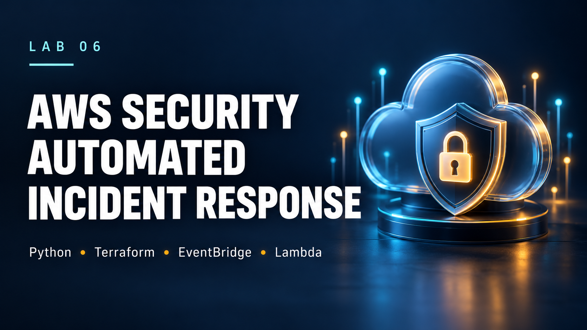

# AWS Security Detection & Automated Incident Response

[](https://github.com/ozangirginwork-wq/aws-security-automated-incident-response/actions/workflows/ci.yml)

A hands-on AWS security engineering project that detects dangerous security group changes and automatically remediates public SSH exposure using an event-driven, least-privilege architecture.



## Skills Demonstrated

**AWS • CloudTrail • EventBridge • Lambda • Python/Boto3 • IAM • Terraform • GitHub Actions • Incident Response • Security Automation • Pytest**

The project demonstrates a complete incident-response workflow:

**Detect → Investigate → Remediate → Verify**

When an AWS security group is modified to allow SSH (TCP/22) from `0.0.0.0/0`, CloudTrail records the API activity, EventBridge routes the relevant event to Lambda, the response code removes the dangerous ingress rule, and a separate verification step queries AWS to confirm that the exposure is gone.

---

## Architecture Overview


```text
Security Group Change
        │
        ▼
   AWS CloudTrail
        │
        ▼
 Amazon EventBridge
        │
        ▼
 Incident Response Lambda
        │
        ├── Detect
        ├── Investigate
        ├── Remediate
        └── Verify
        │
        ▼
 Protected Security Group
```

Terraform provisions the lab infrastructure so the architecture is reproducible and reviewable as code.

---

## Incident Scenario

The controlled incident is an EC2 security group modification exposing:

```text
TCP/22
0.0.0.0/0
```

This represents SSH being opened to the entire IPv4 internet. Instead of relying on manual response, the lab detects and contains the exposure automatically.

---

## How Detection Works

1. **CloudTrail** records the `AuthorizeSecurityGroupIngress` API event.
2. **EventBridge** matches the relevant security-group change and invokes the response Lambda.
3. The **detector** examines the event and determines whether TCP/22 has been exposed to `0.0.0.0/0`.
4. Benign changes such as restricted SSH access or public HTTPS are ignored.

The implementation and tests also cover numeric TCP, port ranges containing 22, all-protocol rules, IPv6 public exposure, duplicate delivery, and verification failures.

---

## Investigation

For a detected incident, the Lambda extracts structured context including the API event, identity type, actor, source IP, affected security group, AWS Region, timestamp, and severity. This information supports the response decision and provides useful CloudWatch logging for investigation.

---

## Automated Remediation

The response stage calls:

```text
ec2:RevokeSecurityGroupIngress
```

The remediation is intentionally narrow: it removes matching public SSH exposure from the protected lab security group. It does **not** broadly modify unrelated security groups or trusted CIDRs.

Two additional safety controls reduce accidental changes:

- `ENABLE_LIVE_REMEDIATION` gates live modification.
- The remediation function defaults to dry-run behavior when called independently.

Removing a matching public range or all-protocol rule necessarily removes the matching rule as represented by AWS; this is an intentional containment tradeoff in the isolated lab.

---

## Independent Verification

A successful revoke API call is not treated as proof of remediation. After the response, the verifier calls:

```text
ec2:DescribeSecurityGroups
```

and queries the resulting AWS state. The workflow reports success only when public SSH exposure is no longer present.

```text
DETECTED → INVESTIGATED → REMEDIATED → VERIFIED
```

If verification fails, the workflow raises an error rather than falsely reporting the incident as resolved.

---

## Least-Privilege Design

The Lambda execution role follows least-privilege principles:

- `ec2:RevokeSecurityGroupIngress` is scoped to the protected Lab 6 security group.
- `ec2:DescribeSecurityGroups` is read-only and uses `Resource = "*"` because AWS does not support resource-level restriction for that action.
- CloudWatch logging uses the standard Lambda basic execution permissions.
- EventBridge filters for the protected group, while the responder independently checks `PROTECTED_SECURITY_GROUP_ID` as an additional application-level safety boundary.

The repository and CI contain no AWS credentials; CI validates code without deploying infrastructure.

---

## CloudTrail & Logging Security

CloudTrail management events are delivered to a dedicated S3 bucket configured with:

- S3 Block Public Access
- server-side encryption
- HTTPS-only access
- CloudTrail log-file validation
- bucket policy restricted for the lab trail
- 30-day lifecycle expiration

The short retention period keeps the temporary lab lightweight while limiting unnecessary storage.

---

## Infrastructure as Code

Terraform provisions:

- VPC
- protected security group
- restricted default security group
- Lambda execution role and least-privilege IAM policy
- Lambda function
- CloudWatch log group
- EventBridge rule and target
- CloudTrail trail
- encrypted S3 logging bucket

No EC2 instances, NAT Gateways, load balancers, or databases are required.

---

## Testing & CI

Run the local validation suite with:

```bash
python -m pip install -r requirements-dev.txt
python -m pytest tests -q
```

Tests exercise dangerous and benign ingress changes, dry-run/live response behavior, port ranges, IPv6, duplicate delivery, safety gates, and verification failures.

GitHub Actions runs Python tests plus Terraform formatting and validation on pushes and pull requests. The workflow requires no AWS credentials and performs no AWS deployment.

---

## Troubleshooting & Lessons Learned

The project included real implementation and cleanup problems rather than only a successful happy path:

- **Lambda execution time:** the live response approached the original timeout while an additional AWS verification call was being added. The timeout was increased to provide enough room for remediation and independent verification rather than removing the verification control.
- **CI runtime compatibility:** an early GitHub Actions run failed during Python setup with the selected runtime. The workflow was moved to a supported Python 3.12 configuration and validation subsequently passed.
- **CloudTrail cleanup:** Terraform initially could not remove the CloudTrail S3 bucket because it was non-empty. The lab bucket was reviewed/cleaned and a later `terraform plan -destroy` reported no remaining Terraform-managed objects.

These failures reinforced three operational lessons: verify state instead of trusting API success, treat CI failures as reproducibility problems to diagnose, and plan teardown for stateful logging resources before deployment.

---

## Validation Evidence

Public portfolio evidence is intentionally sanitized. See the [evidence index](evidence/README.md) for the historical deployment, controlled incident, and automated remediation/verification artifacts.

- [Terraform deployment evidence](evidence/01-terraform-apply-sanitized.png)
- [Controlled SSH exposure transcript](evidence/02-security-group-event-sanitized.md)
- [Lambda remediation & verification evidence](evidence/03-lambda-remediation-verified-sanitized.png)

Historical evidence demonstrates the original live TCP/22 IPv4 scenario. Later hardening is validated by automated tests and should not be represented as a new AWS deployment.

---

## Security Controls

| Control | Purpose |
|---|---|
| Event-driven detection | Respond quickly to security-group changes |
| Least-privilege IAM | Restrict remediation capability |
| Protected SG scope | Limit destructive actions to the lab target |
| Dry-run support | Safely test remediation logic |
| Live-remediation gate | Prevent unintended live changes |
| Independent verification | Confirm the AWS resource is actually secure |
| CloudTrail logging | Preserve AWS API activity |
| S3 encryption & Block Public Access | Protect audit logs |
| Automated tests | Validate detection and response behavior |
| Credential-free CI | Validate code without storing AWS secrets |

---

## Repository Structure

```text
aws-security-automated-incident-response/
├── .github/workflows/       # CI validation
├── architecture/            # Architecture diagram
├── assets/                  # Portfolio visual
├── lambda/                  # Detection, investigation, response, verification
├── terraform/               # AWS Infrastructure as Code
├── tests/                   # Automated Python tests
├── sample-events/           # Synthetic test events
├── evidence/                # Sanitized historical evidence
├── docs/                    # Incident report and threat model
├── requirements-dev.txt
├── SECURITY.md
└── README.md
```

---

## Security & Repository Hygiene

Sensitive local artifacts are excluded from source control, including Terraform state/variables, environment files, deployment archives, and private-key formats. Sample events use synthetic identifiers and documentation-only IP addresses rather than real environment information.

See [`SECURITY.md`](SECURITY.md) for the repository security policy.

---

## Technologies

**AWS:** Lambda, CloudTrail, EventBridge, S3, CloudWatch, IAM, VPC, EC2 Security Groups  
**Infrastructure & Development:** Terraform, Python, Boto3, Pytest, Git, GitHub Actions, AWS CLI

---

## Project Status

**Working end-to-end lab implementation with automated regression testing.**

The original live exercise demonstrated:

```text
Security group exposed
        ↓
CloudTrail event generated
        ↓
EventBridge detected the API call
        ↓
Lambda automatically invoked
        ↓
Public SSH rule detected
        ↓
Dangerous ingress rule revoked
        ↓
AWS state independently queried
        ↓
Remediation VERIFIED
```

The lab infrastructure was subsequently torn down. Historical screenshots/logs are evidence of that exercise, not evidence of a currently deployed AWS environment.

---

## Scope & Production Considerations

This is an educational/portfolio security engineering lab, not a production incident-response platform.

The trigger currently focuses on `AuthorizeSecurityGroupIngress`; pre-existing exposure and changes made through other APIs would require additional detection or periodic reconciliation. A production implementation would also typically add centralized observability, alerting, retries/dead-letter handling, multi-account support, approval/escalation workflows, broader incident enrichment, and operational runbooks.

---

## Related Portfolio Labs

[Lab 1: Linux support & troubleshooting](https://github.com/ozangirginwork-wq/linux-it-support-troubleshooting-lab) · [Lab 2: Windows Server & Active Directory](https://github.com/ozangirginwork-wq/windows-server-active-directory-lab) · [Lab 3: Python IT automation](https://github.com/ozangirginwork-wq/python-it-cloud-automation-lab) · [Lab 4: AWS security incident investigation](https://github.com/ozangirginwork-wq/aws-security-incident-response-lab) · [Lab 5: Secure Terraform & CI security](https://github.com/ozangirginwork-wq/terraform-cicd-pipeline)
