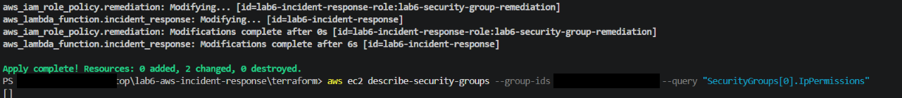
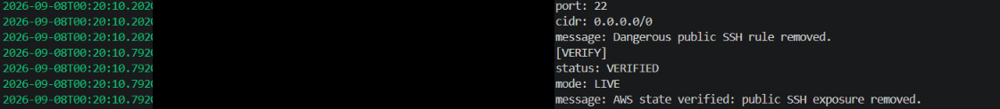
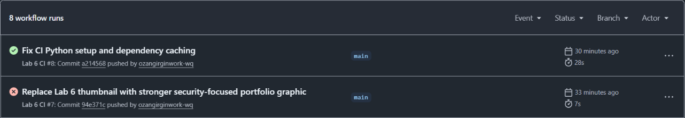

# Evidence highlights

Three focused views from the original lab work, curated on September 25, 2026. These are historical captures, not new test runs or proof of a currently deployed environment.

The images are cropped to the relevant output. Solid black blocks mark redacted identifiers; commands and results have not been rewritten. Local lab names, private addresses and public service endpoints are retained where useful.

## 1. Terraform update and state query

The visible original terminal output shows 0 added, 2 changed, 0 destroyed, followed by an empty IpPermissions query result. The crop excludes the earlier explanatory overlay; local user-path and security-group identifiers are redacted.

## 2. Remediation and independent verification

The visible original log excerpt reports removal of the dangerous public SSH rule, status VERIFIED and mode LIVE. The identifying log-stream string is redacted. This is the original IPv4 scenario, not a fresh deployment.

## 3. CI recovery after Python setup fix

The original Actions list shows the Python setup/dependency-caching fix passing after an earlier failed run. It demonstrates CI recovery and does not itself prove live AWS remediation.

## Source and integrity notes

Crops were reviewed for readability and sensitive data before publication. Hashes below identify the published crops, not the unedited sources. Existing source captures elsewhere in the repository are retained.

| Published crop | SHA-256 |
| --- | --- |
| `01-terraform-update.png` | `7eee70591109785931b61fe084f07ec49b2b28bf8807fe2a9a309c92598d8f66` |
| `02-remediation-verification.png` | `007735659a8a5ee95fc382034524dc5df41921657715a72c42d897e25543d1e9` |
| `03-ci-recovery.png` | `103b0ada8ce47074e8e704720b4213b8d788344482498d2ec623ae2a927bbdbd` |

[Back to project](../../README.md)
